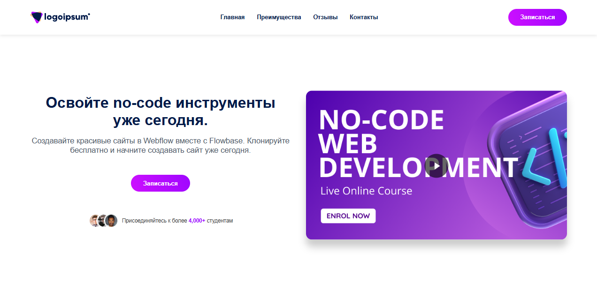
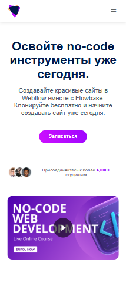

# Landing Course Project

## Overview
This project is a responsive landing page designed to showcase a programming course. It is built using modern web development practices, including SCSS/SASS for styling and the BEM (Block Element Modifier) methodology for structuring CSS classes.

## Screenshots

### Desktop Version


### Mobile Version


## Features
- **Responsive Design**: Optimized for various screen sizes.
- **SCSS/SASS**: Modular and maintainable styling.
- **BEM Methodology**: Ensures clean and scalable CSS.
- **Interactive Elements**: Includes buttons, play overlays, and decorative visuals.
- **Reusable Components**: Styles and components are organized for scalability.

## Technologies Used
- **HTML5**: Semantic structure.
- **SCSS/SASS**: Advanced styling.
- **BEM**: CSS methodology.

## File Structure
```
landing-course/
├── index.html
├── src/
│   ├── scss/
│   │   ├── base/
│   │   ├── blocks/
│   │   ├── utils/
│   ├── assets/
│   │   ├── fonts/
│   │   ├── img/
│   ├── style.scss
│   └── main.js
└── public/
```

## Why This Project?
This project demonstrates proficiency in:
- Building responsive layouts.
- Writing modular and maintainable SCSS.
- Implementing BEM methodology for scalable CSS.
- Creating visually appealing and interactive web pages.

## How to Run
1. Clone the repository.
2. Install dependencies (if applicable).
3. Open `index.html` in your browser.

## Author
This project was created as part of a portfolio to showcase web development skills.

## Русская версия
Для русской версии этого README, пожалуйста, смотрите [README_RU.md](README_RU.md).